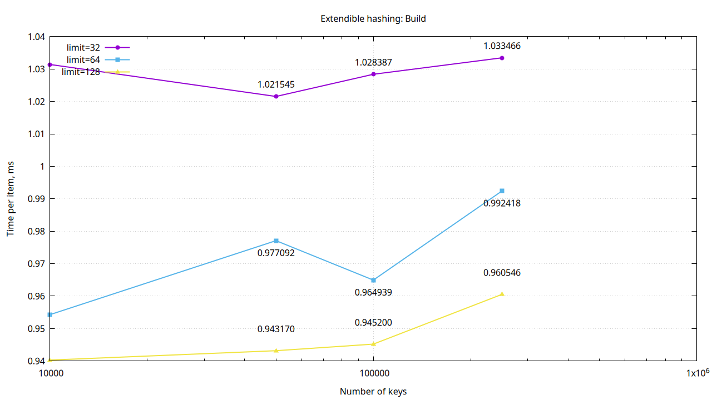
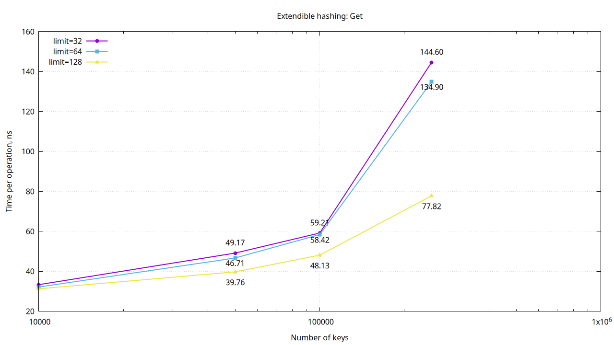
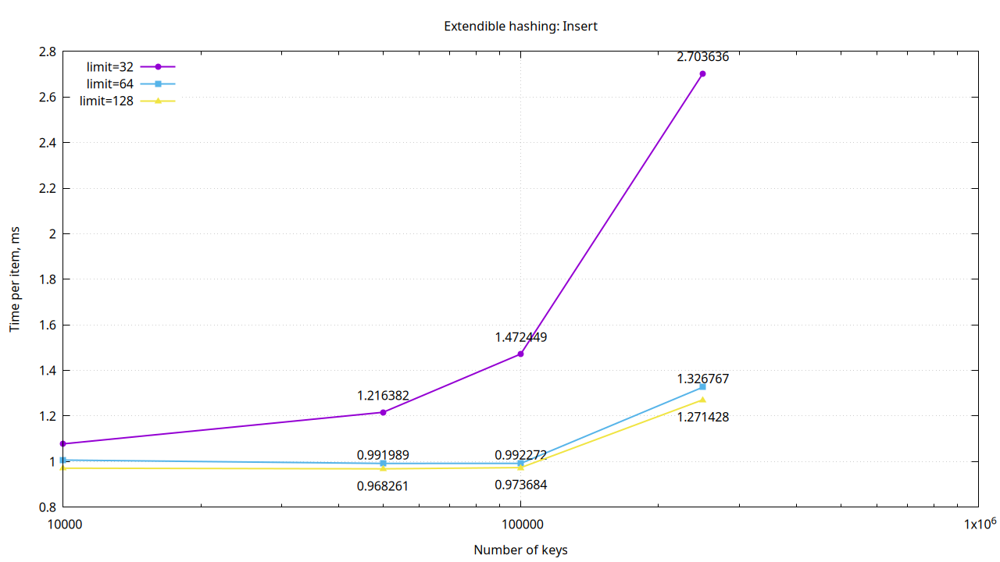
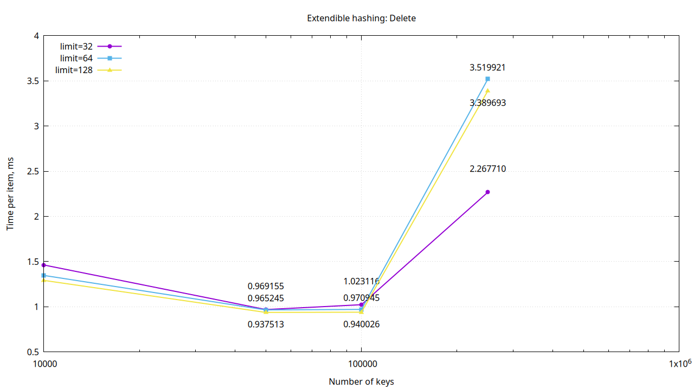
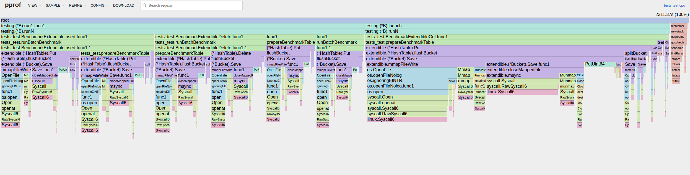
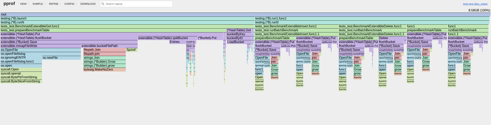

## Как работает

Используется FNV-1a: ключ int64 переводится в 8 байт little-endian, после чего вычисляется 64-битный хеш  
Таблица хранится на диске в виде meta и набора файлов bucket_\<id\>  
meta содержит globalDepth, bucketLimit, nextBucketID и directory — массив bucketID  
Каждый бакет хранит id, localDepth, count и пары key-value. Чтение и запись выполняются через mmap; при записи дополнительно вызывается msync, затем munmap и close

Построение:
1) Создаем директорию таблицы, meta, два стартовых бакета и сохраняем их на диск (globalDepth = 1)
2) Для пары key-value считаем хеш
3) По младшим globalDepth битам хеша находим индекс в directory
4) Directory дает bucketID, по нему получаем нужный бакет
5) Если ключ уже есть - обновляем значение; если в бакете еще есть место - вставляем пару  
Если бакет переполнен:
- если localDepth == globalDepth, удваиваем directory
- создаем новый бакет
- увеличиваем localDepth
- перепривязываем часть directory на новый бакет
- перераспределяем записи старого бакета по двум бакетам
6) После изменения бакет и meta сохраняются на диск через mmap + msync

Поиск:
1) Считаем хеш ключа
2) По младшим битам находим индекс бакета в директории
3) Загружаем бакет из памяти или с диска
4) Ищем ключ в slots map[int64]int64 этого бакета

Удаление:
1) Находим бакет по ключу
2) Удаляем ключ из бакета
3) Сохраняем бакет
4) Пытаемся слить бакет с buddy:
- localDepth должен совпадать
- суммарный размер двух бакетов должен помещаться в bucketLimit
5) Если merge возможен:
- переносим записи
- меняем directory
- удаляем файл лишнего бакета
- при возможности сжимаем directory обратно (ShrinkDirectory)

## Бенчмарки
BenchmarkExtendibleBuild - построение таблицы с нуля
BenchmarkExtendibleGet - чтение существующих ключей
BenchmarkExtendibleInsert - вставка нового набора ключей в уже построенную таблицу
BenchmarkExtendibleDelete - удаление ключей из уже построенной таблицы

Параметры:
Пары = 10к, 50к, 100к, 250к
Лимиты бакета = 32, 64, 128

Построение:  
  
Близко к линейному. Видно, что больший лимит бакета немного лучше, т.к. меньше сплитов

Получение:  
  
Видно, что больший бакет дает лучшую эффективность (при поиске читаем таблицу в память 1 раз - в самом начале, так что это тест теплой структуры)

Вставка:  
  
Результаты сопоставимы с build: больше лимит бакета - меньше сплитов. Но вставка сама по себе дороже, тк бакеты уже частично заполнены -> раньше начнем сплитоваться

Удаление:  
  
На 250к пар стоимость удаления резко возрастает. Скорее всего, здесь накладываются:
- сохранение бакета после каждого Delete
- попытки merge
- возможный ShrinkDirectory
- удаление лишнего bucket-файла
- повторное сохранение meta

Выводы:
- Build масштабируется близко к линейному, но цена на элемент высокая из-за постоянной работы с файлами
- Алгоритм чувствителен к bucketLimit: маленькие бакеты приводят к частым split и сильному росту стоимости операций
- Delete самая тяжелая модифицирующая операция, потому что кроме удаления включает попытку merge и shrink
- Для этой реализации наиболее разумный компромисс выглядит как bucketLimit=64 или 128; 32 слишком часто приводит к деградации

## Профилирование

CPU  
  
Видно, что больше всего времени уходит на работу с ОС во время сохранения данных, что ожидаемо 

MEM  
  
Тоже видно, что тяжелее всего не сам поиск, а: постоянные апдейты бакетов и работа с диском

## Улучшения
1) Очевидное слабое место это персистентная запись на диск: open -> truncate -> mmap -> записать -> msync -> munmap -> close почти на каждую мутацию. Можно сделать флаш на диск реже или сразу батчевый флаш
2) Уменьшить кол-во аллокаций при сплите бакетов (сейчас копируем старые Entries, чистим бакета, а потом заново раскладываем)
3) Снизить накладные расходы на файловый путь и открытие файлов (что и как???)
4) Добавить bulk-create (сейчас построение через множественный Put)
