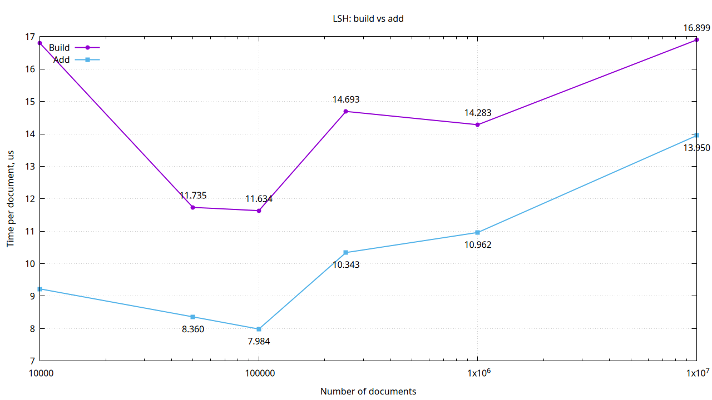
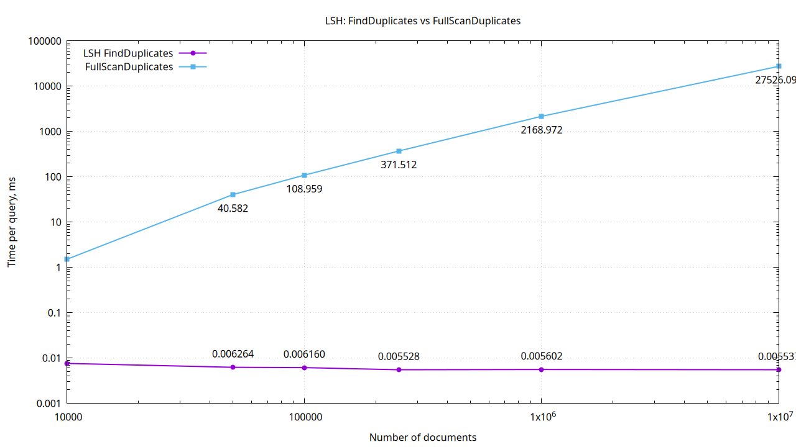
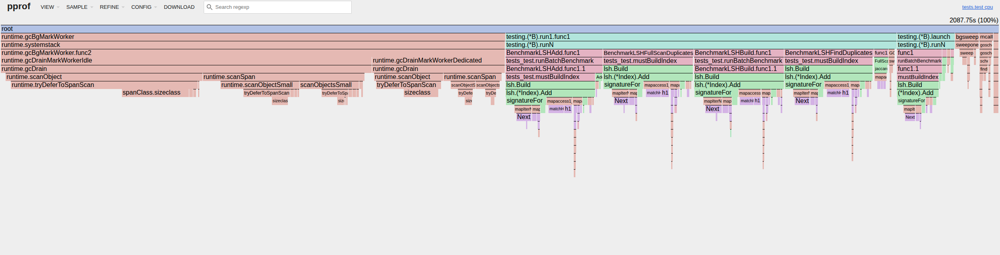
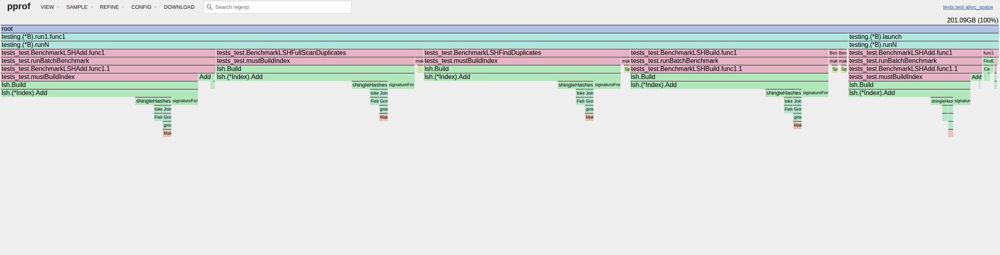

## Как работает

Добавление:
1) Приводим текст к нижнему регистру; оставляем только буквы и цифры
2) Бьем текст на токены
3) Составляем из токенов n-граммы (шинглы)
4) Получаем множество хешей от n-грамм 
5) Строим MinHash-сигнатуру из H значений (mix64) (для каждой хеш-фукнции берем минимальное значение по шинглам)
6) Делим сигнатуру на m band-ов
7) Берем хеш от каждого band и кладем но нему документ в бакет 

Поиск:
1) Приводим текст к нижнему регистру; оставляем только буквы и цифры
2) Бьем текст на токены
3) Составляем из токенов n-граммы (шинглы)
4) Получаем множество хешей от n-грамм
5) Строим MinHash-сигнатуру (mix64)
6) Делим сигнатуру на m band-ов
7) Из совпавших по band-ам бакетов собираем список документов
8) Считаем схожесть по Жаккару 
9) Отсеиваем по трешхолду t

## Бенчмарки
BenchmarkLSHBuild — полная сборка индекса по набору документов
BenchmarkLSHAdd — добавление новых документов в уже существующий индекс
BenchmarkLSHFindDuplicates — поиск дубликатов через LSH
BenchmarkLSHFullScanDuplicates — поиск дубликатов полным перебором без LSH

Параметры:  
Документы = 10к, 50к, 100к, 250к, 1м, 10м  
cfg.NumHashes = 64 (H)  
cfg.Bands = 8 (m)  
cfg.ShingleSize = 2 (n)  
cfg.SimilarityThreshold = 0.5 (t)  

Построение/добавление:  
  
Виден близкий к линейному рост для обеих операций. Добавление дешевле, т.к. не требует полной пересборки индекса

Поиск:  
  
Время поиска через LSH не зависит от размера корпуса документов. Для сравнения приведен линейный перебор

## Профилирование

CPU:  

Видно достаточно тяжелый Add - добавление документов в индекс, это норм тк он считает minhash  
Также видно, что GarbageCollector съедает очень много времени (50%), что говорит о большом количестве аллокаций

MEM:

Тут видно, что у нас дорогой по памяти Add, который требует много ресурсов для построения временных структур при индексации  
Оба профиля показывают, что узкое место это добавление новых документов: происходит много аллокаций на временные структуры, как следствие, много процессорного времени уходит на работу GC

## Улучшения
1) Упростить токенизацию. Сейчас сначала побуквенно нормализуем текст, после чего дробим на список отдельных строк
2) Не собирать шингл строкой. Можно хешировать напрямую из токенов или, например, заранее хешировать токены 
3) Хранить id как int, а не string

