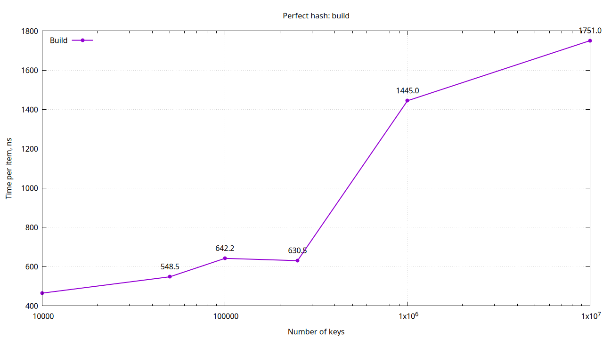
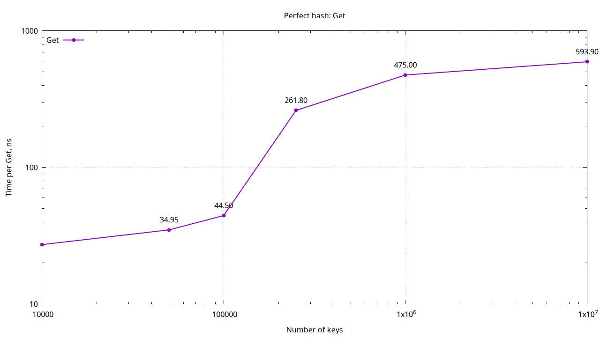
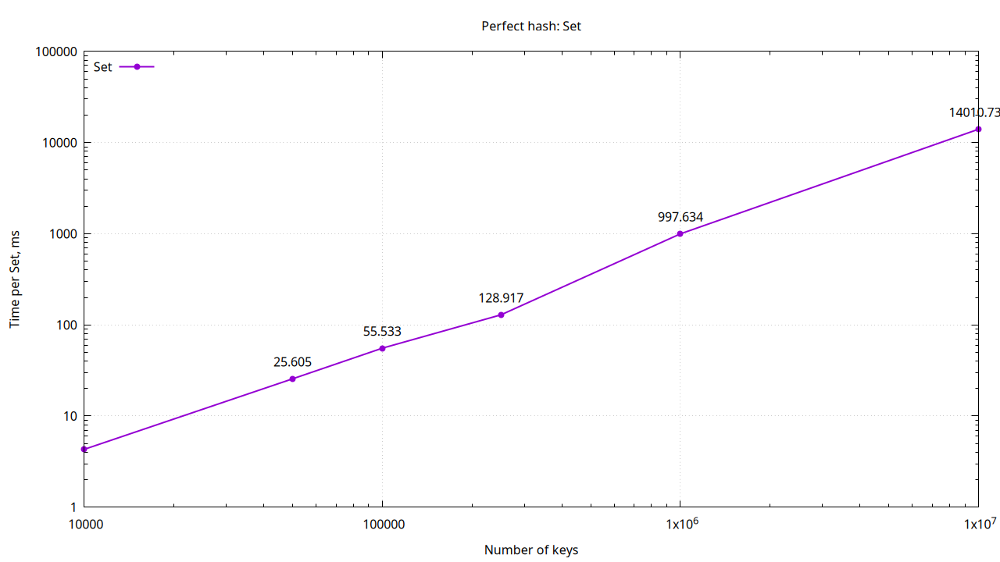
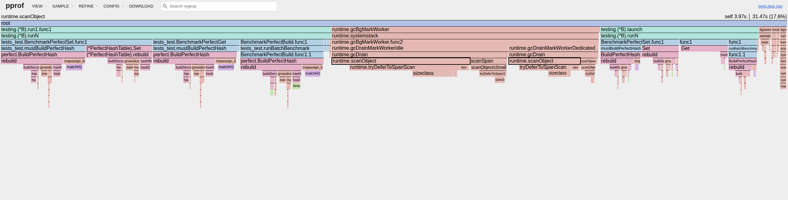
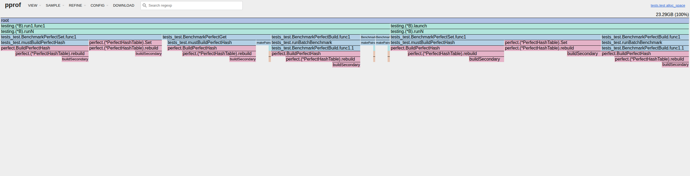

## Как работает

Базовые ф-ии: FNV-1a, DJB2 или SDBM

Построение:
1) Складываем пары key-value в map
2) Выбираем базовую ф-ию
3) Раскладываем ключи по бакетам первого уровня по базовой хеш ф-ии
4) Для бакетов первого уровня строим бакеты второго уровня, подбирая хеш ф-ию и seed так, чтобы не было коллизий

Поиск:
1) Считаем хеш первого уровня, по нему определяем бакет
2) Бакет пустой - ключа нет; один слот - сравниваем ключ; много слотов - берем хеш второго уровня 

## Бенчмарки
1) BenchmarkPerfectBuild - полная сборка таблицы по массиву пар
2) BenchmarkPerfectSet - добавление одного нового ключа в уже построенную таблицу
3) BenchmarkPerfectGet - чтение существующего ключа из готовой таблицы

Параметры:

Пары = 10к, 50к, 100к, 250к, 1м, 10м

Построение:

Построение близко к линейному. Начинает существенно расти после  250к 

Поиск:

Добавление в индекс (де-факто, перестроение):

## Профилирование

CPU:

Видно тяжелый build (rebuild). Также видно, что много времени уодит на работу GC

MEM:

Как и ожидалось, самое тяжелое место - build (rebuild) таблицы при построении. После чего идет secondary rebuild
Это связано с пересборкой ключей по бакетам и созданием secondary slot листов

Улучшения:
1) Убрать лишние аллокации в build (при работе с парами)
2) Сделать базовую хеш-функцию детерменированной (сейчас она random(1,3))
3) Оптимизировать структуры для второго уровня (сейчас берем slots len(m) * len(m))

