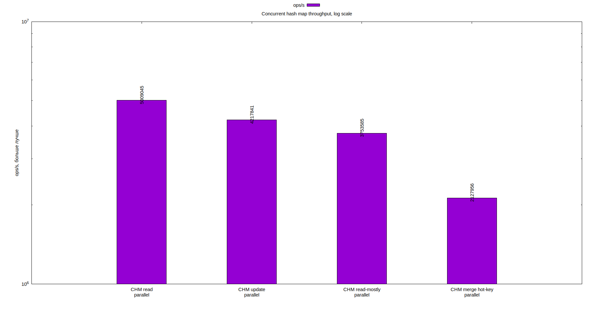

# Лабораторная 4. Thread-safe hash table

## Идея реализации

Для конкурентности выбран подход с локами на бакеты:

- Каждый бакет хранит свою цепочку элементов и защищается отдельным `sync.RWMutex`.
- `Get` берет read-lock только на нужный бакет.
- `Put` и `Merge` берут write-lock только на нужный бакет. Записи в разные бакеты могут выполняться параллельно.
- Размер таблицы хранится в `atomic.Int64`, поэтому `Size` не берет общий lock.
- `resizeMu` используется как барьер для операций, которые меняют массив бакетов целиком: `grow`, `Clear`, `Pairs`, `Iterator`. Обычные `Get`, `Put` и `Merge` не сериализуются одним writer-lock'ом на всю таблицу.
- `Iterator` и `Pairs` копируют пары под read-lock'ами всех бакетов, поэтому возвращают консистентный snapshot.

## Тестирование

- `TestPutGetSizeAndClear` проверяет базовый жизненный цикл таблицы: вставку новых ключей, обновление существующего ключа, чтение через `Get`, корректный `Size` и очистку через `Clear`.
- `TestMerge` проверяет обе ветки `Merge`: вставку отсутствующего ключа и обновление существующего значения через пользовательскую функцию объединения.
- `TestIteratorUsesSnapshot` проверяет snapshot-семантику итератора. Сначала создается итератор по таблице с 10 элементами, затем сама таблица очищается и в нее добавляется новый ключ. Итератор после этого должен пройти именно старые 10 элементов, а не новое состояние таблицы.

- `TestConcurrentMergeIsLinearizableForSingleKey` запускает 16 goroutine, каждая делает 1000 вызовов `Merge("counter", 1, sum)`. Ожидаемый результат равен `16 * 1000`. Этот тест проверяет, что конкурентные записи в один горячий ключ не теряют обновления и сериализуются lock'ом одного бакета.
- `TestConcurrentReadersObserveCompletedWrites` запускает одного writer'а, который делает `Put` для 1000 ключей, и 8 параллельных reader'ов, которые одновременно вызывают `Get` и `Size`. Если reader видит ключ, значение должно быть уже полностью корректным. После завершения writer'а дополнительно проверяется, что все завершенные записи видны в таблице.

## Бенчмарки

Latency-бенчмарки сравнивают `ConcurrentHashMap` с `UnsafeHashMap`: вокруг каждого вызова `Get`, `Put`, `Merge` или `Pairs` берется `time.Now()`, после операции считается `time.Since()`, а в `ns/op` записывается средняя длительность именно этих вызовов. `UnsafeHashMap` используется как baseline обычной неконкурентной хеш-таблицы с той же закрытой адресацией.

Throughput-бенчмарки запускаются только для `ConcurrentHashMap` через `RunParallel` и показывают `ops/s`, то есть сколько операций concurrent-реализация выполняет в секунду под параллельной нагрузкой.

Latency-сценарии:

- `ConcurrentHashMapReadLatencySequential` / `UnsafeHashMapReadLatencySequential`: чтение из заранее заполненной таблицы.
- `ConcurrentHashMapPutUpdateLatencySequential` / `UnsafeHashMapPutUpdateLatencySequential`: обновление уже существующих ключей.
- `ConcurrentHashMapPutInsertNoGrowLatency` / `UnsafeHashMapPutInsertNoGrowLatency`: вставка новых ключей в таблицу с заранее достаточной емкостью.
- `ConcurrentHashMapPutInsertWithGrowLatency` / `UnsafeHashMapPutInsertWithGrowLatency`: вставка новых ключей с ростом таблицы.
- `ConcurrentHashMapMergeHotKeyLatencySequential` / `UnsafeHashMapMergeHotKeyLatencySequential`: `Merge` в один ключ.
- `ConcurrentHashMapPairsSnapshotLatency` / `UnsafeHashMapPairsSnapshotLatency`: создание snapshot-списка всех пар из 4096 элементов.
- `ConcurrentHashMapReadMostlyLatencyParallel`: смешанная нагрузка, примерно 15 чтений на 1 обновление.
- `ConcurrentHashMapPutUpdateLatencyParallel`: параллельное обновление уже существующих ключей.

Throughput-сценарии:

- `ConcurrentHashMapReadThroughputParallel`: параллельное чтение.
- `ConcurrentHashMapPutUpdateThroughputParallel`: параллельное обновление существующих ключей.
- `ConcurrentHashMapReadMostlyThroughputParallel`: смешанная read-mostly нагрузка.
- `ConcurrentHashMapMergeHotKeyThroughputParallel`: конкурентный `Merge` в один горячий ключ.

## Графики

| Benchmark | avg latency ns/op |
| --- | ---: |
| ConcurrentHashMapReadLatencySequential | 57.378 |
| UnsafeHashMapReadLatencySequential | 34.508 |
| ConcurrentHashMapPutUpdateLatencySequential | 69.490 |
| UnsafeHashMapPutUpdateLatencySequential | 33.288 |
| ConcurrentHashMapPutInsertNoGrowLatency | 205.089 |
| UnsafeHashMapPutInsertNoGrowLatency | 109.678 |
| ConcurrentHashMapPutInsertWithGrowLatency | 389.944 |
| UnsafeHashMapPutInsertWithGrowLatency | 261.256 |
| ConcurrentHashMapMergeHotKeyLatencySequential | 45.726 |
| UnsafeHashMapMergeHotKeyLatencySequential | 20.062 |
| ConcurrentHashMapPairsSnapshotLatency | 309251.889 |
| UnsafeHashMapPairsSnapshotLatency | 75555.889 |
| ConcurrentHashMapPutUpdateLatencyParallel | 3950.556 |
| ConcurrentHashMapReadMostlyLatencyParallel | 3469.444 |

| Benchmark | ops/s |
| --- | ---: |
| ConcurrentHashMapReadThroughputParallel | 5009045.111 |
| ConcurrentHashMapPutUpdateThroughputParallel | 4217841.000 |
| ConcurrentHashMapReadMostlyThroughputParallel | 3753584.778 |
| ConcurrentHashMapMergeHotKeyThroughputParallel | 2127955.556 |

| Benchmark | B/op | allocs/op |
| --- | ---: | ---: |
| ConcurrentHashMapReadLatencySequential | 0.000 | 0.000 |
| UnsafeHashMapReadLatencySequential | 0.000 | 0.000 |
| ConcurrentHashMapPutUpdateLatencySequential | 0.000 | 0.000 |
| UnsafeHashMapPutUpdateLatencySequential | 0.000 | 0.000 |
| ConcurrentHashMapPutUpdateLatencyParallel | 0.000 | 0.000 |
| ConcurrentHashMapPutInsertNoGrowLatency | 24.000 | 1.000 |
| UnsafeHashMapPutInsertNoGrowLatency | 24.000 | 1.000 |
| ConcurrentHashMapPutInsertWithGrowLatency | 188.000 | 2.000 |
| UnsafeHashMapPutInsertWithGrowLatency | 92.000 | 2.000 |
| ConcurrentHashMapReadMostlyLatencyParallel | 0.000 | 0.000 |
| ConcurrentHashMapMergeHotKeyLatencySequential | 0.000 | 0.000 |
| UnsafeHashMapMergeHotKeyLatencySequential | 0.000 | 0.000 |
| ConcurrentHashMapPairsSnapshotLatency | 65536.000 | 1.000 |
| UnsafeHashMapPairsSnapshotLatency | 65536.000 | 1.000 |

## Выводы

Последовательное чтение занимает `57.378 ns/op` у `ConcurrentHashMap` и `34.508 ns/op` у `UnsafeHashMap`. Разница объясняется синхронизацией: конкурентная таблица берет `resizeMu.RLock` и `RLock` конкретного бакета.

Обновление существующего ключа занимает `69.490 ns/op` у concurrent-таблицы и `33.288 ns/op` у unsafe-таблицы. Обе операции не аллоцируют память, потому что меняется поле `value` в уже существующем `entry`.

Вставка новых ключей без роста таблицы занимает `205.089 ns/op` у concurrent-таблицы и `109.678 ns/op` у unsafe-таблицы. Обе версии получают `24 B/op` и `1 allocs/op`: это выделение нового узла цепочки. При росте таблицы concurrent-версия получает `389.944 ns/op`, `188 B/op` и `2 allocs/op`, unsafe-версия - `261.256 ns/op`, `92 B/op` и `2 allocs/op`.

`Merge` в один ключ занимает `45.726 ns/op` у concurrent-таблицы и `20.062 ns/op` у unsafe-таблицы. В параллельном throughput-сценарии hot-key `Merge` дает `2127955.556 ops/s`, потому что все goroutine сериализуются на lock одного бакета.

`PairsSnapshot` занимает `309251.889 ns/op` у concurrent-таблицы и `75555.889 ns/op` у unsafe-таблицы. Обе версии выделяют `65536 B/op`, но concurrent-версия дополнительно берет read-lock'и всех бакетов.

Throughput concurrent-таблицы: чтение - `5009045.111 ops/s`, обновление существующих ключей - `4217841.000 ops/s`, read-mostly нагрузка - `3753584.778 ops/s`, hot-key `Merge` - `2127955.556 ops/s`.
