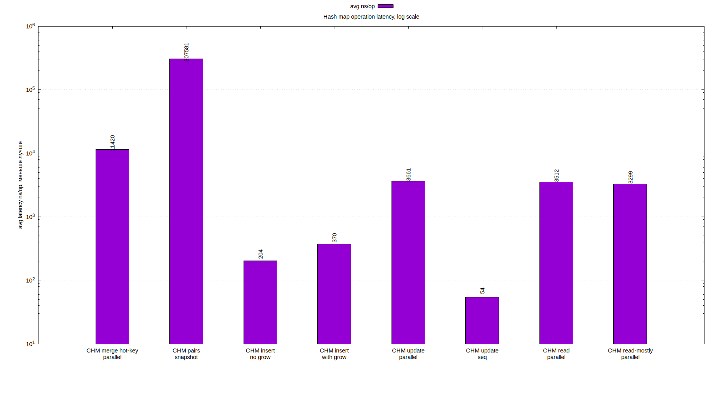
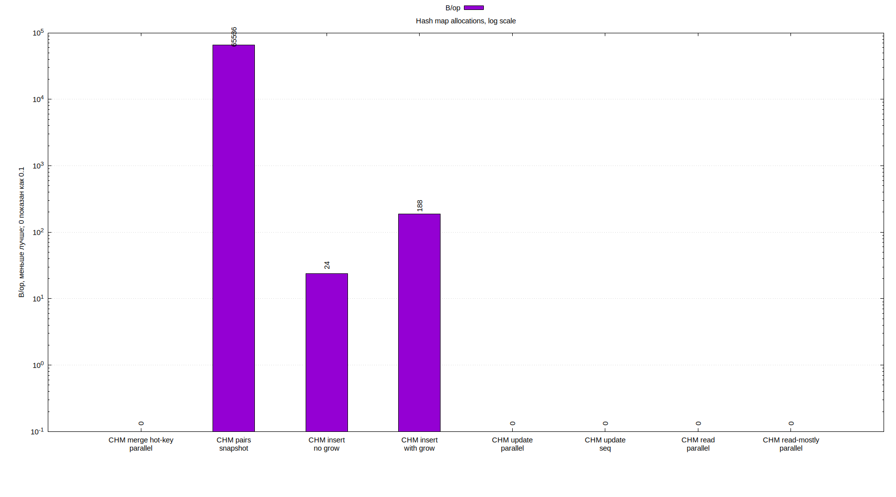
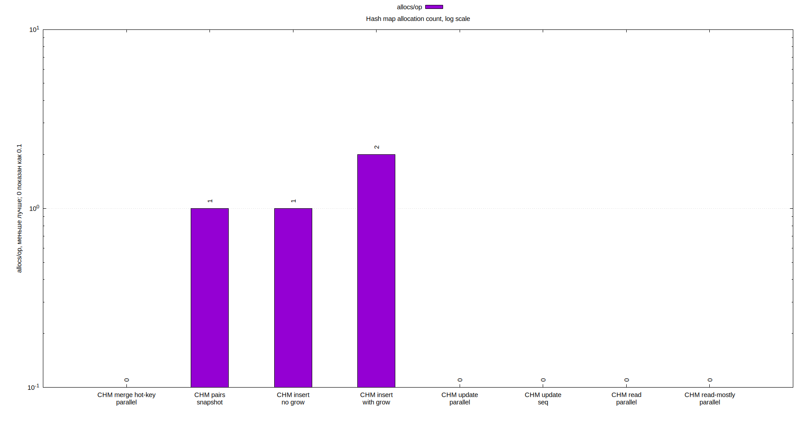

# Лабораторная 4. Thread-safe hash table

## Идея реализации

Для конкурентности выбран подход с локами на бакеты:

- Каждый бакет хранит свою цепочку элементов и защищается отдельным `sync.RWMutex`.
- `Get` берет read-lock только на нужный бакет.
- `Put` и `Merge` берут write-lock только на нужный бакет. Записи в разные бакеты могут выполняться параллельно.
- Размер таблицы хранится в `atomic.Int64`, поэтому `Size` не берет общий lock.
- `resizeMu` используется как барьер для операций, которые меняют массив бакетов целиком: `grow`, `Clear`, `Pairs`, `Iterator`. Обычные `Get`, `Put` и `Merge` не сериализуются одним writer-lock'ом на всю таблицу.
- `Iterator` и `Pairs` копируют пары под read-lock'ами всех бакетов, поэтому возвращают консистентный snapshot.

## Тестирование

Функциональные сценарии:

- `TestPutGetSizeAndClear` проверяет базовый жизненный цикл таблицы: вставку новых ключей, обновление существующего ключа, чтение через `Get`, корректный `Size` и очистку через `Clear`.
- `TestMerge` проверяет обе ветки `Merge`: вставку отсутствующего ключа и обновление существующего значения через пользовательскую функцию объединения.
- `TestIteratorUsesSnapshot` проверяет snapshot-семантику итератора. Сначала создается итератор по таблице с 10 элементами, затем сама таблица очищается и в нее добавляется новый ключ. Итератор после этого должен пройти именно старые 10 элементов, а не новое состояние таблицы.

Concurrency-сценарии:

- `TestConcurrentMergeIsLinearizableForSingleKey` запускает 16 goroutine, каждая делает 1000 вызовов `Merge("counter", 1, sum)`. Ожидаемый результат равен `16 * 1000`. Этот тест проверяет, что конкурентные записи в один горячий ключ не теряют обновления и сериализуются lock'ом одного бакета.
- `TestConcurrentReadersObserveCompletedWrites` запускает одного writer'а, который делает `Put` для 1000 ключей, и 8 параллельных reader'ов, которые одновременно вызывают `Get` и `Size`. Если reader видит ключ, значение должно быть уже полностью корректным. После завершения writer'а дополнительно проверяется, что все завершенные записи видны в таблице.
- Вся тестовая пачка запускается с `-race`. Это проверяет, что параллельные `Put`, `Get`, `Size` и `Merge` не создают data race. Для этой реализации это важно, потому что операции работают с mutable-цепочками внутри бакетов.

## Бенчмарки

Бенчмарки измеряют latency отдельных операций: вокруг каждого вызова `Get`, `Put`, `Merge` или `Pairs` берется `time.Now()`, после операции считается `time.Since()`, а в `ns/op` записывается средняя длительность именно этих вызовов. Для параллельных сценариев это не throughput-derived `ns/op` из `RunParallel`, а средняя latency операций, выполненных конкурентными goroutine.

Набор сценариев:

- `ConcurrentHashMapReadLatencyParallel`: параллельные чтения из заранее заполненной таблицы.
- `ConcurrentHashMapPutUpdateLatencySequential` и `ConcurrentHashMapPutUpdateLatencyParallel`: обновление уже существующих ключей.
- `ConcurrentHashMapPutInsertNoGrowLatency`: вставка новых ключей в таблицу с заранее достаточной емкостью.
- `ConcurrentHashMapPutInsertWithGrowLatency`: вставка новых ключей с ростом таблицы.
- `ConcurrentHashMapReadMostlyLatencyParallel`: смешанная нагрузка, примерно 15 чтений на 1 обновление.
- `ConcurrentHashMapMergeHotKeyLatencyParallel`: конкурентный `Merge` в один горячий ключ.
- `ConcurrentHashMapPairsSnapshotLatency`: создание snapshot-списка всех пар из 4096 элементов.

## Графики

| Benchmark | avg latency ns/op |
| --- | ---: |
| ConcurrentHashMapReadLatencyParallel | 3511.556 |
| ConcurrentHashMapPutUpdateLatencySequential | 54.152 |
| ConcurrentHashMapPutUpdateLatencyParallel | 3661.111 |
| ConcurrentHashMapPutInsertNoGrowLatency | 204.367 |
| ConcurrentHashMapPutInsertWithGrowLatency | 369.744 |
| ConcurrentHashMapReadMostlyLatencyParallel | 3298.778 |
| ConcurrentHashMapMergeHotKeyLatencyParallel | 11420.111 |
| ConcurrentHashMapPairsSnapshotLatency | 307580.889 |

| Benchmark | B/op | allocs/op |
| --- | ---: | ---: |
| ConcurrentHashMapReadLatencyParallel | 0.000 | 0.000 |
| ConcurrentHashMapPutUpdateLatencySequential | 0.000 | 0.000 |
| ConcurrentHashMapPutUpdateLatencyParallel | 0.000 | 0.000 |
| ConcurrentHashMapPutInsertNoGrowLatency | 24.000 | 1.000 |
| ConcurrentHashMapPutInsertWithGrowLatency | 188.000 | 2.000 |
| ConcurrentHashMapReadMostlyLatencyParallel | 0.000 | 0.000 |
| ConcurrentHashMapMergeHotKeyLatencyParallel | 0.000 | 0.000 |
| ConcurrentHashMapPairsSnapshotLatency | 65536.000 | 1.000 |

## Выводы

Чтение в параллельном сценарии занимает в среднем `3511.556 ns/op`. Операция берет `resizeMu.RLock` и `RLock` конкретного бакета, поэтому latency включает стоимость двух read-lock'ов и возможное ожидание при конкурентной работе.

Последовательное обновление существующего ключа занимает `54.152 ns/op` и не аллоцирует память: меняется поле `value` в уже существующем `entry`. Параллельное обновление получает `3661.111 ns/op`, потому что операции конкурируют за locks отдельных бакетов и за общий `resizeMu.RLock`.

Вставка новых ключей без роста таблицы занимает `204.367 ns/op`, `24 B/op` и `1 allocs/op`: это выделение нового узла цепочки. Вставка с ростом таблицы занимает `369.744 ns/op`, `188 B/op` и `2 allocs/op`, потому что часть операций дополнительно переносит элементы в новый массив бакетов.

Смешанная read-mostly нагрузка занимает `3298.778 ns/op` при `0 B/op`: обновления существующих ключей и чтения не создают новых узлов.

`Merge` в один горячий ключ занимает `11420.111 ns/op`, потому что все goroutine сериализуются на lock одного бакета. При распределении ключей по разным бакетам записи могут идти параллельно.

`PairsSnapshot` занимает `307580.889 ns/op`, блокирует все бакеты на чтение и выделяет слайс под 4096 пар, поэтому получает `65536 B/op` и `1 allocs/op`.
